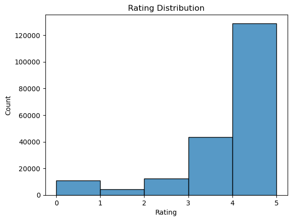
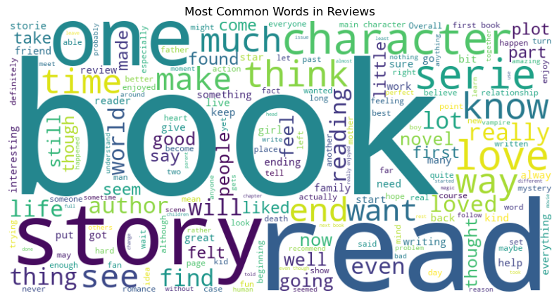

# Book Recommendation Project

This repository contains the code and resources for building a Book Recommendation System using Goodreads review data. The project aims to predict whether a user will read a specific book, classify the category of the book based on its reviews, and predict the user's rating of the book. 

## Table of Contents
- [Background](#background)
- [Data](#data)
- [Methods](#methods)
- [Results](#results)
- [Model Evaluation](#model-evaluation)
- [Conclusion](#conclusion)
- [Repository Structure](#repository-structure)
- [How to Run](#how-to-run)

## Background

Recommender systems are vital in the digital age, enabling platforms to provide personalized content to users. This project focuses on building a robust recommendation system using Goodreads data, a popular platform where users rate and review books.

**Key Goals:**
1. **Read Prediction**: Predict if a user will read a particular book.
2. **Category Prediction**: Classify the genre of a book based on its reviews.
3. **Rating Prediction**: Estimate the rating a user will give to a book.

## Data

The data for this project was sourced from Goodreads, containing user interactions, book ratings, and detailed book reviews. The dataset is split into training, validation, and test sets for model development and evaluation.

### Data Sources:
- **Interactions**: User interactions with books, including ratings and reviews.
- **Categories**: Book categories derived from user reviews.

### Sample Data:
- **User Interactions**: Over 200,000 user-book interactions, including ratings.
- **Book Categories**: Reviews and their associated genres for thousands of books.

## Methods

The project employs a combination of machine learning techniques to achieve the prediction goals:

### 1. **Exploratory Data Analysis (EDA)**
   - Visualizations of rating distributions and word cloud analysis of review text.
   - Identification of data patterns, distributions, and potential correlations.

### 2. **Data Preprocessing**
   - Cleaning and preprocessing of text data using techniques like TF-IDF.
   - Merging and preparation of interaction and category data for modeling.

### 3. **Modeling Techniques**
   - **Baseline Models**: Simple popularity-based models to set a baseline for read prediction.
   - **Jaccard Similarity Model**: A similarity-based model using Jaccard index for read prediction.
   - **Hybrid Model**: Combining Jaccard similarity and popularity-based thresholds to improve prediction accuracy.
   - **Neural Network Model**: Leveraging deep learning for higher accuracy in read predictions.
   - **Bias Model for Rating Prediction**: Predicting ratings using user and item biases with regularization.

## Results

The project achieved the following results:

### Read Prediction:
- **Baseline Model Accuracy**: ~60%
- **Optimized Jaccard Similarity Model**: Improved accuracy by fine-tuning thresholds.
- **Hybrid Model Accuracy**: ~65%
- **Neural Network Model Accuracy**: ~95%

### Category Prediction:
- **Logistic Regression Model**: Achieved a validation accuracy of ~80% in predicting book categories based on review text.

### Rating Prediction:
- **Bias Model**: The model predicted ratings with an MSE of 1.62, corresponding to an RMSE of approximately 1.27 on a 1-5 rating scale.

### Visualizations:
- **Rating Distribution**: Showed the distribution of user ratings across different books.
  
  
- **Word Cloud**: Highlighted the most common words in user reviews.
  

## Model Evaluation

The models were evaluated based on:
- **Accuracy**: For classification tasks like read prediction and category prediction.
- **Mean Squared Error (MSE)**: For regression tasks such as rating prediction.

Key takeaways:
- **Hybrid models** combining different approaches yielded the best results in read prediction.
- **Neural networks** significantly boosted prediction accuracy, though they require more computational resources.
- **Regularization** improved the performance of the bias model by reducing overfitting.

## Conclusion

This project demonstrates the effectiveness of combining traditional machine learning methods with deep learning techniques in building a robust book recommendation system. By integrating various models and optimizing parameters, the system provides accurate and personalized recommendations for users based on their reading history and preferences.

## Repository Structure

- `data/`: Contains the training and test datasets.
- `notebooks/`: Jupyter notebook used for EDA, preprocessing, and model development.
- `images/`: Visualizations and figures used in the README.
- `README.md`: Project overview and documentation.

## How to Run

1. **Clone the repository**:
   ```bash
   git clone https://github.com/akanksha-maker-ucsd/Book-Reccomendation.git
   cd book-recommendation
   ```

2. **Install the required dependencies**:
   ```bash
   pip install -r requirements.txt
   ```

3. **Run the Jupyter notebooks** to explore data, train models, and generate predictions:
   ```bash
   jupyter notebook
   ```

4. **Make predictions** using the trained models by running the appropriate scripts in the `models/` directory.

5. **Explore the results**: Generated predictions and visualizations are saved in the `results/` directory.
